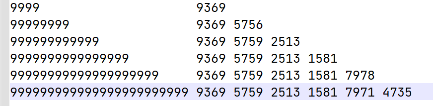
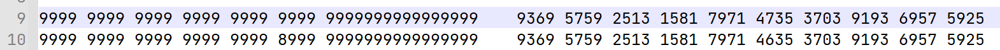
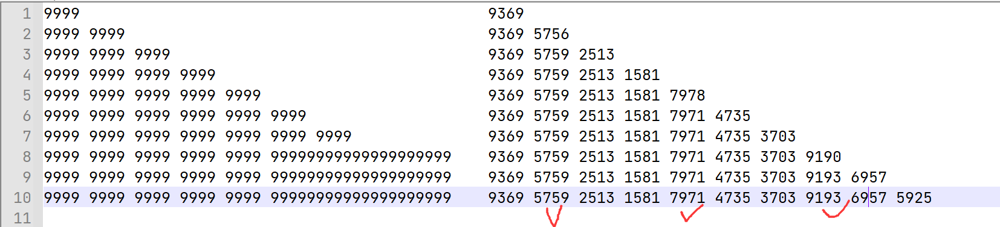
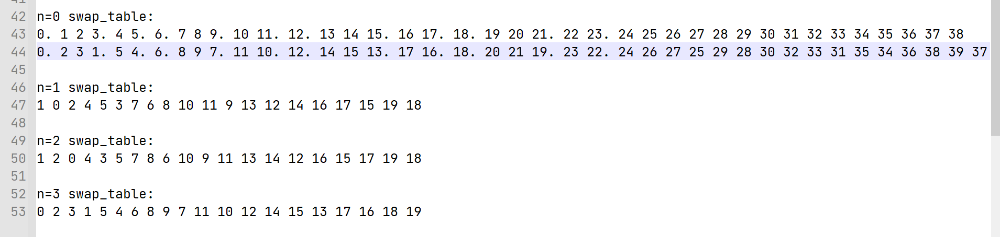

# ToyLockCrack

Lenor

## 这个是思路随记，一边做一边写的，直接看不容易看懂，请先看题解

**这个是思路随记，一边做一边写的，直接看不容易看懂，还有很多是绕的弯路实际上根本没用到，请先看题解**

## 破解思路

### 时间复杂度

经过分析，程序的时间复杂度应该为 O(n)

### 密文分析

密文是一个字符串，而非一个数字

n 位明文对应密文是 n +1 位

### 校验位

在 1 开头的密文中，

19 <- 1

10 <- 9

对于 n 位明文，有 n 种可能的密文

100，有 1351 1597 1613

1000，有 19075（2） 16374（1） 14708（0） 41107（3）

但是 n=1 是特例，只会生成 1 种密文，但是实际上有两种可解的密文。（ TODO

猜测校验方式：

​	猜测校验码可能插入在 0~n+1 的任何一位，使得有 n 种不同的密文。

​	由于 0~10 的数据是连续变化的，但更高的不是。猜测是和校验。

​	c = sum(s[0] + s[1]  + .....) % 10

对于 100

​	c(1351) =0，c(1597）=2，c（1613）=1。猜测 c 是校验位位置。（已经对 1000 验证过了，c是 0~3

​	拿掉校验位：

​	351（1） 113（6） 157（9） / 135（1） 163（1） 197（5）（不知道这个 c 是怎么数的）

​	n = 0/1/2

​	c(351)=9 c(113)=5 c(157)=3

​	c(135) = 9 c(163)=0 c(197)=7

​	其中，对应的校验码分别为 1 1 5，

​	似乎第二种对应关系更有联系。c 和 n 同时变大，校验码不变。猜测和校验结果与 c、n 有关且是差的关系。

​	 c - n = 9, 9, 5

​	995 实际对应 115 猜测是 c=10-c

对 1000 验证：

​	可行

总结：

​	校验码规则是 对于密文 s，随机生成一个 n 使得 n 不大于 s 的长度

​	在倒数第 n 位插入校验码，值为 10 - sum(s) + n

## 无校验码

100:

135 163 197 是三种原始密文。猜测加密方式与 n 有关

先排除 n 的影响并移除校验码

n=0

10000000 14706867

10000001 14706868

10000002 14706869

n=1

10000000 16350171

10000001 16350181

10000002 16350191

可见密文是有特征值的

移位规则

1000000000

0->2       2

1->0       3

2->1       3

3->3       0

4->5       1

5->4       3

6->8       2

7->6       3

8->7       3

9->9       0

估计是四位为一个加密字节。

验证：n=0,9999 去校验码密文是 9369

9999                             9369

99999999                    93695756

999999999999           936957592513

9999999999999999  9369575925131581

可见校验码是可以拆分的

1234 1893

12345678 -> 18932335

那么 2335 很明显是 5678 对应的加密。

但是5678 无论 n=几，都加密不出 2335 

哎，但是 ppl 肯定很懒，多半这些数字是用的迭代加密器

所以我们生成长一点的数据

好像还是看不出什么，此外，每个第二组都会有不同，对其他数据的解析也是这个结果

所以先测试第三位

2513

我们尝试解密一下 2513

已知 9999 --神奇加密--> 2513

那么肯定是少了一个校验码

2513 有四种校验码补法，经过测试，

25139 <- 2431

25103 <- 0189

25113 <- 7418

22513 <- 9164

32513 <- 7456

好像没什么规律

但是笔者无意中发现 1581 加入校验码变成 15815

解码后是 1111，会不会有神奇关系？

测试 888888888888888888888888 8258 4648 1402 0470 的0470

加入校验码后是 04709，解码后是 0000

测试 7 的序列，果然也是这样

所以果然还是偷懒了

那再回看 9999 对应的 2513,2513 会不会也是 1111 的一种加密呢？

1111 的四种加密是

1581 2645 2986 4218

好吧，没有任何关系

总结：

nnnnnnnnnnnnnnnnnnnnnnnn aaaa bbbb cccc dddd eeee ffff (n=0)

aaaa = d(nnnn,0) dddd=d((10-n)x4,0)

那么对于  gggg 有没有类似的性质呢？

n=9 时， gggg 是3703（补全后是 37037）

有 3703=d(3333,0)

即 gggg=d((12-n)x4,0)

合理怀疑一下，cccc 也一定有类似的性质

n=9 是，cccc 是 2513 ，前面解析过 2513了，不行。难道 2513 是乱序的？

写了个程序排列组合破解

也不行

## 对应关系

可见是明文的每 4 位对应密文的每 4 位且没有乱序。

所以重点是解析内部的四位对应关系

假设函数 dd(abcd,n,k)=wxyz

代表校验码是 n 的时候 abcd 对应的无校验码密文（第 k 组）

当n=0，k=1时

w=a

x=d-6

y=b-3

z=c

当n=1,k=1时

w=b-9

x=a-5

y=c-7

z=d-6

当n=2,k=1时

w=a-7

x=b-3

y=c-4

z=d-5

当n=3，k=1时

w=a+3

x=

y=b+1

z=

好，这样所有 四位数以内的加密都搞定了

 ## 高位加密

现在已知加密是 4 位一来的

但是后面的组还是会对前面的最后一位有影响

怀疑是有类似“进位”的规则 

例如get_certain_c("9999", 1) = 0423，get_certain_c("99990", 1)=0427 7，相对于 0 使得 9999 的结果 +4 了

所以研究一下进位规则

get_certain_c("9999", 0)=9369 get_certain_c("99990", 0)=93694 get_certain_c("99992", 0)=93695

……

好吧，目前来看没什么特殊的

当 n=1 时

99990000~99999999 的 进位是 try_shift(suffix)（算法好懒，给我猜出来了

猜测进位都是 try_shift(suffix)，因为进位都一样

n=1 时第一组进位，n=0 时第二组进位，n=2 时第一组进位

## SWAP TABLE

无意中发现，好像处理位数并不是 4，只不过恰好和 4 有关

当 n = 0 时，是1 3 2 1 3 2 一起处理

=1 时移动一位

=2 时再移动

=3 是回到 =0 的状态

## 加密破解

既然得到了 swap table，那么就相当于可以计算出 单个数字的密码

然后就是快乐的打表！详见 auto detect

通过对生成的数据分析，得到的加密规则是：（t 代表位置）

一个数字a一组的加密方式：

z = a + n + t

两个数字ab一组的加密方式:

y = b - n + t + 12

z = a + n + t + 4

三个数字abc一组的加密方式:

x = c + 13 - n + t

y = a + 16 - n + t

z = b + n + t + 9

然后拼合

