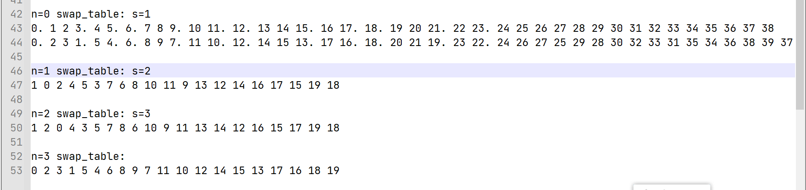

# 题解

Lenor

## 检验方法

加密函数为 lock_with_swap.py 中的 gen_all_cip，输入为数字字符串。输出为全部的密文可能性。<del>这个解法有一点点小问题，就是没有处理当结尾剩余位数小于现在处理位数时的情况，因此可能不完全正确。但是懒得改了，只影响 1~2 位（外加一个校验位）。</del>

更新：我是弱智吧我，我终于想出来是怎么会是了。直接把处理位数变成剩余位数就行了。

## 答案

解密算法就不写了，反正就是反着来一下。

下面是加密算法：（lock with swap.py里面有实现）

对于一个待加密数字字符串 s，生成一个随机的校验码位置 n ，使得 n < len(s)。

依次将每 3/2/1 位字符作为一个整体进行处理。第一次处理的数量为 (n+1) % 3。

一个数字a一组的加密方式：

z = a + n + t

两个数字ab一组的加密方式:

y = b - n + t + 12

z = a + n + t + 4

三个数字abc一组的加密方式:

x = c + 13 - n + t

y = a + 16 - n + t

z = b + n + t + 9

最后把 xyz 依次拼起来就是最终的无校验码答案 do。

校验码 ：在倒数第 n 位插入校验码，值为 10 - sum(do) + n

## 解题思路

### 密文分析

密文是一个字符串，而非一个数字

n 位明文对应密文是 n +1 位。因此认为密文中的一位对应、且仅对应明文中的一位的加密结果

n+1位，刚好有一位多出来了。所以认为其中有一位是校验码

如果真的有校验位，校验位规则是什么呢？

### 校验位

在 1 开头的 密文中（a <- b 代表 b 加密结果是 a），

19 <- 1

10 <- 9

对于 n 位明文，经过测试有 n 种可能的密文

100，有 1351 1597 1613

1000，有 19075（2） 16374（1） 14708（0） 41107（3）

但是 n=1 是特例，只会生成 1 种密文，但是实际上有两种可解的密文。（随机测试中，8 只会生成密文 82，但如果用 29 解密也可以得到 8，这是在生成数据的时候意外发现的）

猜测校验方式：

​	猜测校验码可能插入在 0~n+1 的任何一位，使得有 n 种不同的密文。

​	由于 0~10 生成的密文每一位都是连续变化的，但是再大的数字就不是了。因此先排除奇偶检验。因为奇偶校验的性质和位数无关

​	那么考虑同样常用的和校验。

​	c = sum(s[0] + s[1]  + .....) % 10

此外还有一点：校验位在位置不定的情况下，能被解码出来。因此肯定有一种办法可以直接从密文中找到校验位的位置。和校验有类似奇偶校验的性质，因此尝试 c(f) 为校验位置。

对于 100 的加密结果而言，

​	c(1351) =0，c(1597）=2，c（1613）=1。猜测 c 是校验位位置。（已经对 1000 验证过了，c是 0~3

​	拿掉校验位：

​	351（1） 113（6） 157（9） / 135（1） 163（1） 197（5）（校验位可能是正数或者反这数）

​	n = 0/1/2

​	c(351)=9 c(113)=5 c(157)=3

​	c(135) = 9 c(163)=0 c(197)=7

​	其中，对应的校验码分别为 1 1 5，

​	似乎第二种对应关系更有联系，因为 c 和 n 同时变大时，校验码不变。猜测和校验结果与 c、n 有关且是差的关系。

​	 c - n = 9, 9, 5

​	995 实际对应 115 猜测是 c=10-c

对 1000 验证：

​	可行

就这样得到了校验位的规则

### 密文分析

这样就可以得到不包含校验位的密文。每一个明文根据校验位不同，有多种不同的密文。get certain 可以获取特定校验位位置对应的密文。

这里先分析校验位位数=0 的情况。

n=0

10000000 14706867

10000001 14706868

10000002 14706869

可以发现明文和密文是有对应关系的，明文变化一位，密文变化一位。经过大数据实验，这个猜测是正确的

**这里走了一个超长的弯路，不想看可以跳过**

经过好多次实验，发现（当 n = 0时）如果以每 4 位作为一个间隔分割数据，使数据成为很多组，那么组内的密文值无论如何变化都不会影响组外的密文

例如明文是 9999 xxxx

密文是 abcd efgh

xxxx 无论改成多少，efgh 会变，但是 abcd 不会

所以加密是四个数字为一组的。那么组内算法是什么呢？

假设加密算法是 d(target,n)

意外发现对于明文 12345678

密文的前四位就是 1234 对应的密文

哈哈，所以加密算法的结构肯定是：

> 明文 -》 分成好多组
>
> 加密函数对于每组进行加密
>
> 拼合结果
>
> 添加校验码

嗯，那只要破解出加密函数就行了。为此，制作了一个 auto detect 函数，自动分析明文和密文之间的关系

这样还真搞定了 n = 0123 时的、对四位数的加密（lock.py中的lock4_no_check和lock_u4_no_check）

后来突然发现，除了最开始的四位，这个函数根本不顶用啊！

以及即便如此，在某些时候好像并不是严格按照四个为一个分组的。改变后面的值，有时会对部分分组的最后一位有改动

难道说？存在某种进位关系？

经过大量的研究，猜测了一个进位函数是：try_shift（在get_certian.py）

针对 n=0 的情况还真能用，但是 n!=0 的时候就不行了

哈哈！肯定是有好多进位函数，我只要对所有的 n = 0~10 分析一下就行啦

但是这个肯定很麻烦，我们试着解决另一个问题：“除了最开始的四位，这个函数根本不顶用”

ppl 肯定很懒，所以这个函数如果要应用到后面几位，一定存在一个很简单的、唯一的线性变化关系

我只需要按照前面的方法生成这样的关系，然后手动看看差别就行了

于是继续跑 auto detect，分析明文和密文的关系

跑着跑着我突然意识到：稍等，这关系也太复杂了吧，为什么有一个几乎不重复的常数在里面？

哎！难道之前的猜测——四个一组是错的？

**弯路走完了**

我又想，不对啊，我为什么要分组？只要找到明文中第 i 位对应密文第 k 位的 swap table 不就行了么

所以编写函数 det_pos 自动分析，发现基于 n（校验位位数） 不同，真的存在一个这样的 swap table

而且只有三种对应关系，n=3 之后就和之前是循环的了

那结果就简单了

加密的实际逻辑是：

密文的第 swap_table(i) 位 是明文的 encrypt(xx) 

那获取 encrypt 函数就是个很简单的事情了

它是个绝对线性的函数、并且最多和 n、x、t 有关，其中x 代表明文的这一位的数值，t是这一位的位数

经过长时间的打表

得出了这样的 encrypt 方程

一个数字a一组的加密方式：

z = a + n + t

两个数字ab一组的加密方式:

y = b - n + t + 12

z = a + n + t + 4

三个数字abc一组的加密方式:

x = c + 13 - n + t

y = a + 16 - n + t

z = b + n + t + 9

然后拼合

最后加上校验位就行了。